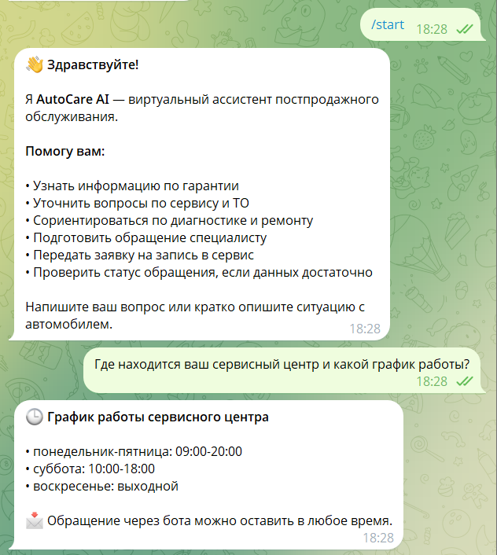
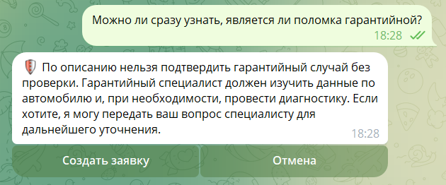
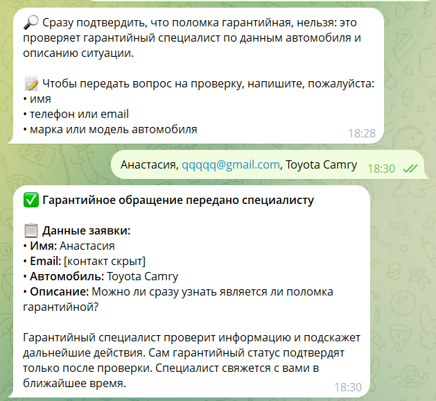
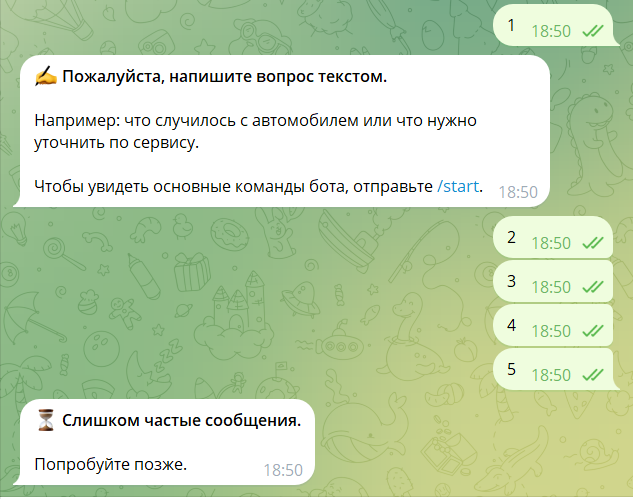
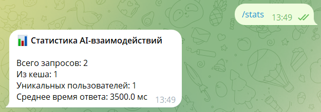

# AutoCare AI

AutoCare AI — AI-ассистент первой линии для постпродажного обслуживания клиентов автодилера или сервисного центра. Он помогает клиентам разобраться с вопросами по гарантии, техническому обслуживанию, диагностике, ремонту, записи на сервис и статусу уже оставленного обращения.

Текущая версия реализована как Telegram-бот на `aiogram`. Основная логика вынесена в отдельные модули: RAG по локальной базе знаний, работа с Google Sheets, парсинг обращений, хранение краткого контекста диалога, приватность, кеширование и ограничение частоты сообщений могут быть адаптированы под другой интерфейс — сайт, клиентский кабинет, CRM или внутренний сервисный инструмент.

## Обзор

Сервисные и гарантийные отделы часто получают повторяющиеся вопросы: что входит в ТО, как оформить гарантийное обращение, как записаться на сервис, что делать при ошибке на панели, как узнать статус заявки. AutoCare AI автоматизирует первичный контакт с клиентом, но не заменяет мастера-консультанта, технического специалиста или гарантийный отдел там, где нужна диагностика, проверка документов или подтверждение условий.

Ассистент не выдумывает цены, сроки ремонта, наличие запчастей, гарантийный статус, адреса и регламенты. Он использует локальную базу знаний, подключенные таблицы Google Sheets и контекст текущего диалога. Если вопрос нужно передать специалисту, бот собирает минимальные данные и сохраняет структурированное обращение в таблицу.

## Польза для бизнеса

AutoCare AI помогает сервисной команде быстрее обрабатывать входящие обращения и аккуратно вести первичный поток клиентских запросов.

- Снижает нагрузку на администраторов, мастеров-консультантов и гарантийных специалистов.
- Дает клиенту быстрый первичный ответ без ожидания оператора.
- Помогает отделить справочный вопрос от обращения, которое нужно передать специалисту.
- Стандартизирует заявки: команда получает структурированные данные вместо разрозненной переписки.
- Сохраняет обращения, записи на сервис и запросы статуса в Google Sheets.
- Не обещает неподтвержденные цены, сроки, наличие запчастей или гарантийный ремонт.
- Хранит только краткий контекст и маскирует чувствительные данные в локальной памяти диалога.
- Structured logging позволяет измерять время AI-ответов, эффективность кеша и анализировать AI-взаимодействия.

## Ключевые сценарии

- Приветствие клиента и объяснение возможностей сервисного ассистента.
- Ответы по базе знаний: гарантия, сервис, ТО, диагностика, ремонт, FAQ, контакты и график.
- Подготовка обращения специалисту по гарантии, диагностике, ремонту или ТО.
- Запись на сервис с уточнением удобного времени визита.
- Сбор первичных данных: имя, телефон или email, автомобиль, суть обращения.
- Дополнительный сбор модели, года, пробега, VIN или госномера, если клиент готов их предоставить.
- Проверка статуса обращения по Telegram ID, телефону, VIN или госномеру.
- Список активных обращений клиента.
- Отмена активного обращения с подтверждением.
- Административная очистка кеша через команду `/clear_cache`.
- Очистка локальной памяти диалога через команду `/clear_memory`.

## Возможности

- Telegram-интерфейс на `aiogram`.
- RAG-ответы по локальной Markdown-базе знаний.
- Локальный векторный индекс ChromaDB.
- Генерация ответов и embeddings через OpenAI API.
- Загрузка дополнительных сервисных тем из Google Sheets.
- Сохранение клиентских обращений в Google Sheets.
- Поиск, список и отмена активных обращений.
- Извлечение данных клиента из свободного текста.
- Краткий локальный контекст диалога для продолжения сценария.
- Маскирование телефона, email, VIN, госномера, паспортных и банковских данных в памяти диалога.
- JSON-кеш для повторяющихся неперсональных вопросов.
- Пропуск кеширования для сообщений с контактами, VIN, госномером и другими чувствительными данными.
- Ограничение частоты сообщений, фильтрация слишком короткого шума и слишком длинных сообщений.
- Structured logging успешно отправленных AI/RAG-ответов в SQLite с `response_time_ms` и признаком `from_cache`.
- HMAC-SHA256-псевдонимизация Telegram user ID перед записью AI/RAG-взаимодействия.
- Административные команды `/stats` и `/logs`, включая CSV-экспорт взаимодействий.
- Техническое логирование работы приложения в отдельный `storage/bot.log`.

## Примеры работы

Стартовый сценарий и ответ по графику работы сервисного центра:



Ответ по базе знаний с предложением передать вопрос специалисту:



Оформление гарантийного обращения с маскированием контактных данных:



Защита от коротких спам-сообщений до обращения к основной логике бота:



## Архитектура

```text
Клиент
   |
   v
Telegram
   |
   v
Rate limiting + обработчик сообщения
   |
   v
Privacy-проверки + маршрутизация
   |
   +--> Локальные сценарии и заявки
   |        |
   |        v
   |   Google Sheets: CustomerRequests
   |
   +--> AI/RAG-вопрос
            |
            v
         JSON-кеш
            |
            +--> Cache hit: готовый ответ
            |
            +--> Cache miss: RAG
            |        |
            |        +--> ChromaDB + ServiceTopics
            |        |
            |        +--> OpenAI API
            |
            v
       Финальный ответ
            |
            v
         Telegram
            |
            v
  Маскирование + псевдонимизация
            |
            v
       DatabaseLogger
            |
            v
    SQLite: storage/logs.db

Технические события и исключения --> storage/bot.log
```

Telegram-слой отвечает за прием сообщений, команды и inline-кнопки подтверждения. Основная логика приложения находится в `src/`: обработчики сценариев, поиск по базе знаний, генерация ответов, работа с Google Sheets, кеширование, приватность, парсинг обращений, локальная память диалога и ограничение частоты сообщений. Structured logging выполняется после успешной отправки AI/RAG-ответа и не заменяет технический журнал `storage/bot.log`.

## Structured logging

В `storage/logs.db` записываются успешно отправленные AI/RAG-взаимодействия. Команды, callback-запросы и локальные бизнес-сценарии без вызова RAG в таблицу `interactions` не добавляются.

Таблица `interactions` хранит:

| Поле | Назначение |
| --- | --- |
| `id` | идентификатор записи |
| `timestamp` | дата и время записи |
| `user_id` | стабильный псевдонимизированный идентификатор пользователя |
| `source` | источник взаимодействия, сейчас `telegram` |
| `query` | запрос пользователя после маскирования |
| `response` | финальный ответ ассистента после маскирования |
| `from_cache` | признак получения ответа из кеша |
| `response_time_ms` | полное время обработки и отправки ответа в миллисекундах |

Исходный Telegram ID и username в `logs.db` не записываются. Telegram ID преобразуется через HMAC-SHA256 с отдельным `LOG_USER_ID_SECRET`. Перед записью `query` и `response` проходят существующую функцию `sanitize_for_memory()`, которая маскирует поддерживаемые категории чувствительных данных: телефон, email, VIN, госномер, паспортные и банковские данные.

| Хранилище | Назначение |
| --- | --- |
| `storage/bot.log` | технические события и исключения приложения |
| `storage/logs.db` | структурированные AI/RAG-взаимодействия |
| `storage/exports/*.csv` | CSV-экспорты, создаваемые командой `/logs` |

Администратор может получить четыре агрегированные метрики через `/stats` и экспортировать текущие записи `interactions` через `/logs`.

## Проверка кеширования

В чистом ручном тесте через Telegram дважды отправлялся один и тот же запрос:

| Запрос | `from_cache` | `response_time_ms` |
| --- | ---: | ---: |
| Первый запрос | 0 | 6899 |
| Повторный идентичный запрос | 1 | 101 |

После теста команда `/stats` вернула:

| Метрика | Значение |
| --- | ---: |
| `total_interactions` | 2 |
| `cache_hits` | 1 |
| `unique_users` | 1 |
| `avg_response_time_ms` | 3500.0 |

### Статистика взаимодействий



В этом конкретном тесте кешированный ответ был примерно в 68 раз быстрее. Это результат одного ручного теста, а не гарантированная производительность или SLA.

## Стек

| Компонент | Назначение |
| --- | --- |
| Python | основной язык проекта |
| aiogram | Telegram bot framework |
| OpenAI API | генерация ответов и embeddings |
| ChromaDB | локальное векторное хранилище для RAG |
| Google Sheets API | хранилище обращений и источник сервисных тем |
| JSON storage | кеш и краткий контекст диалога |
| SQLite / sqlite3 | structured logging AI-взаимодействий, статистика и источник CSV-экспорта |
| python-dotenv | загрузка переменных окружения |
| Markdown | база знаний для RAG |

## Структура проекта

| Путь | Назначение |
| --- | --- |
| `main.py` | точка входа Telegram-бота |
| `ingest.py` | индексация базы знаний в ChromaDB |
| `src/config.py` | загрузка настроек из `.env` |
| `src/handlers.py` | Telegram-обработчики, включая `/stats`, `/logs` и интеграцию structured logging |
| `src/rag.py` | RAG, кеширование и `AnswerResult` с признаком `from_cache` |
| `src/vector_store.py` | embeddings, ChromaDB и поиск релевантных чанков |
| `src/knowledge_loader.py` | загрузка Markdown-документов и metadata базы знаний |
| `src/customer_parser.py` | извлечение имени, контактов, автомобиля, VIN, пробега и типа обращения |
| `src/sheets.py` | интеграция с Google Sheets: обращения, статусы и сервисные темы |
| `src/cache.py` | JSON-кеш повторяющихся неперсональных ответов |
| `src/database_logger.py` | SQLite logging, статистика и CSV-экспорт AI-взаимодействий |
| `src/privacy.py` | маскирование поддерживаемых чувствительных данных и HMAC-псевдонимизация user ID |
| `src/dialog_memory.py` | краткая локальная память последних реплик пользователя |
| `src/middlewares/rate_limiter.py` | rate limiting, короткие сообщения, антиспам и лимит длины |
| `prompts/system_prompt.md` | системные правила поведения сервисного ассистента |
| `knowledge_base/` | база знаний по гарантии, сервису, ТО, обращениям, контактам и FAQ |
| `knowledge_base/_metadata.json` | metadata документов базы знаний |
| `docs/screenshots/` | скриншоты интерфейса и пользовательских сценариев |
| `storage/` | runtime-данные: кеш, контекст диалога, `bot.log`, `logs.db`, CSV-экспорты и ChromaDB; каталог исключён из Git |
| `credentials/` | локальные credentials для Google service account |

## Быстрый старт

Рекомендуется Python 3.11+.

```powershell
python -m venv .venv
.\.venv\Scripts\Activate.ps1
pip install -r requirements.txt
Copy-Item .env.example .env
```

Заполните `.env`, затем соберите индекс базы знаний:

```powershell
python ingest.py
```

Для индексации нужен `OPENAI_API_KEY`, потому что embeddings создаются через OpenAI API.

Запустите бота:

```powershell
python main.py
```

Бот запускается в polling mode. Для работы нужны реальные значения `BOT_TOKEN` и `OPENAI_API_KEY`.

## Конфигурация

Создайте `.env` на основе `.env.example` и заполните переменные:

```env
BOT_TOKEN=your_telegram_bot_token_here
OPENAI_API_KEY=your_openai_api_key_here
OPENAI_MODEL=gpt-4o-mini
OPENAI_EMBEDDING_MODEL=text-embedding-3-small

CHROMA_DB_DIR=storage/chroma
KNOWLEDGE_BASE_DIR=knowledge_base
SYSTEM_PROMPT_PATH=prompts/system_prompt.md

GOOGLE_SHEETS_CREDENTIALS_FILE=credentials/google-service-account.json
GOOGLE_SHEETS_SPREADSHEET_ID=your_google_sheet_id_here
GOOGLE_CUSTOMER_REQUESTS_WORKSHEET=CustomerRequests
GOOGLE_SERVICE_TOPICS_WORKSHEET=ServiceTopics

CACHE_FILE=storage/cache.json
DIALOG_CONTEXT_FILE=storage/dialog_context.json
LOG_FILE=storage/bot.log
INTERACTION_LOG_DB_FILE=storage/logs.db
LOG_USER_ID_SECRET=

ADMIN_TELEGRAM_ID=your_admin_telegram_id_here
RATE_LIMIT_MESSAGES=8
RATE_LIMIT_WINDOW_SECONDS=60
```

`LOG_USER_ID_SECRET` должен быть отдельным случайным секретом, реальное значение которого хранится только в `.env`. Нельзя использовать вместо него Telegram token, OpenAI API key или другой существующий ключ.

`ADMIN_TELEGRAM_ID` используется для административных команд, включая `/clear_cache`, `/stats` и `/logs`.

Если Google Sheets не настроен, бот сможет отвечать по базе знаний и OpenAI, но не сможет сохранить обращение, найти статус или загрузить дополнительные сервисные темы из таблицы.

## База знаний

База знаний хранится в `knowledge_base/`. В текущей версии индексируются Markdown-файлы:

- `contacts.md`
- `faq.md`
- `maintenance.md`
- `request_intake.md`
- `service.md`
- `warranty.md`

Metadata документов хранится в `knowledge_base/_metadata.json`. Через поле `index` можно исключить документ из индексации.

После изменения файлов базы знаний нужно пересобрать индекс:

```powershell
python ingest.py
```

Скрипт загружает Markdown-документы, делит текст на чанки, создает embeddings через OpenAI и сохраняет локальный индекс в ChromaDB. Коллекция называется `autocare_knowledge_base`.

## Google Sheets

Google Sheets используется в двух ролях:

- `CustomerRequests` — таблица обращений клиентов;
- `ServiceTopics` — дополнительные сервисные темы для контекста ответов.

### Лист CustomerRequests

Если листа нет, бот создаст его и добавит заголовки. При сохранении обращения добавляется строка со следующими данными:

- дата и время;
- Telegram ID;
- username;
- имя клиента;
- телефон;
- email;
- марка;
- модель;
- год выпуска;
- пробег;
- VIN или госномер;
- тип обращения;
- описание обращения;
- желаемое время визита;
- приоритет;
- статус;
- комментарий специалиста.

Для проверки статуса бот ищет обращение по Telegram ID, телефону, VIN или госномеру. Завершенные, закрытые и отмененные обращения не попадают в список активных заявок.

### Лист ServiceTopics

Лист `ServiceTopics` используется как дополнительный источник контекста для RAG-ответа. Рекомендуемые колонки:

- `Категория`;
- `Описание`;
- `Какие данные собрать`;
- `Ответственный отдел`;
- `Приоритет по умолчанию`;
- `Когда передавать специалисту`;
- `Статус`.

Строки со статусом `inactive` не добавляются в контекст ответа.

## Работа с данными и приватность

AutoCare AI рассчитан на сбор только тех данных, которые нужны для первичной обработки обращения.

- Для обращения достаточно имени, телефона или email, автомобиля и краткого описания ситуации.
- Для записи на сервис дополнительно уточняется удобный день или период визита.
- VIN и госномер можно передать, если клиент готов их предоставить, но они не обязательны на первом этапе.
- Сообщения с телефоном, email, VIN, госномером, паспортными или банковскими данными не кешируются.
- В локальной памяти диалога чувствительные данные маскируются.
- В Google Sheets сохраняется структурированное обращение, а не полный лог переписки.
- Бот не просит паспортные данные, банковские реквизиты и лишние персональные данные.

Хранилища выполняют разные задачи:

- **Google Sheets:** содержит бизнес-данные заявок. Telegram ID используется бизнес-логикой для поиска заявок пользователя.
- **`storage/logs.db`:** содержит только структурированные AI/RAG-взаимодействия. User ID псевдонимизирован, username не записывается, а `query` и `response` проходят `sanitize_for_memory()` перед записью.

## Команды бота

| Команда | Назначение |
| --- | --- |
| `/start` | приветствие и краткое описание возможностей |
| `/help` | подсказка по типам вопросов и данным для обращения |
| `/clear_cache` | очистка кеша, доступна только администратору |
| `/clear_memory` | очистка локальной памяти диалога пользователя |
| `/stats` | статистика AI-взаимодействий, доступна только администратору |
| `/logs` | создание и отправка CSV с AI-взаимодействиями, доступно только администратору |

## Границы ответственности

- Текущий пользовательский интерфейс — Telegram.
- Ассистент использует только базу знаний, подключенные таблицы и данные текущего диалога.
- Ассистент не ставит технический диагноз.
- Ассистент не дает инструкции по самостоятельному ремонту.
- Ассистент не подтверждает, что случай гарантийный или негарантийный.
- Ассистент не обещает гарантийный ремонт, точную стоимость, сроки, наличие запчастей или дату визита без подтверждения специалиста.
- Ассистент не принимает оплату и не оформляет заказ-наряд.
- Финальные решения принимает сервисный, технический или гарантийный специалист.
